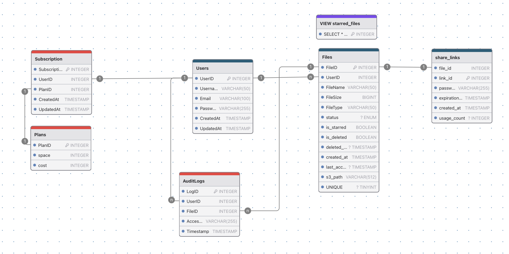
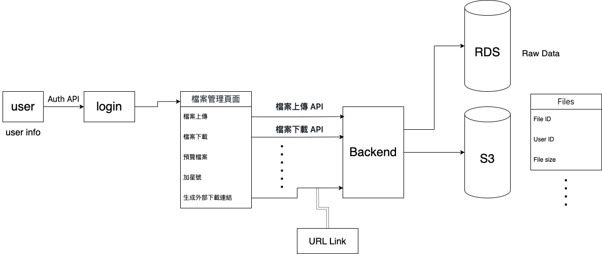

## SQL 的 Schema

#### 主要資料表 (User, File, share_links)
1. 首先，因為有登入的功能，所以必須要有 User 資料表，記錄著基本資訊
2. 因為是檔案系統，所以必有 Files 資料表，以下解釋比較特別的欄位
   - status: 狀態（如 active, trash, deleted）
   - is_starred: 是否加星號
   - is_deleted: 是否移至垃圾桶
   - delete_at: 刪除時間（ 為了紀錄刪除天數 ）
   - last_access: 紀錄上次存取時間 （以利後續統計個資料使用次數）
   - s3_path: 紀錄實體資料位置
   - UNIQUE:  UNIQUE(user_id, file_name) 設定 unique，同一使用者不允許重複檔案名稱
3. 因為有功能為「對非用戶分享連結」，故新增 share_links table
   - 每當 File owner 建立自己的連結時，就會在 share_links 生成一筆資料，其中需要設定 expiration time 以及對應的 password
   - usage_count: 統計下載次數
4. 在「以加星號」的功能中，我們使用 View 來處理，原因如下
   - 簡化查詢邏輯：View 是基於現有的查詢邏輯創建的虛擬表格。
   - starred_files View 預先定義了只顯示 is_starred = TRUE 的檔案。這樣可以在每次篩選加星檔案時避免重複撰寫查詢條件，讓程式碼更簡潔易懂。
   - 增強可讀性和維護性：在 SQL 查詢或應用程式中，直接使用 starred_files 視圖相當於直接查詢「已加星檔案」表格，提高了查詢的語義清晰度。

#### 其他資料表 (Subscription, Plans, AuditLogs) -> 不一定會使用
1. 組員有想到，如果可以將這個服務變成是「訂閱制的」，不同價格擁有不同的雲端空間，因此有了Subscription, Plans
2. AuditLogs 單純記錄每次存取的紀錄

---
## NoSQL 的 Schema

#### schema 說明
- user 會先登入，這邊會驗證相關的 API，驗證通過的話就進到他的個人頁面，在這邊可以主要有五項功能，包含檔案上傳、下載等等。
- 特別討論過的地方應該是因為我們想嘗試看看 Serverless 的架構，因此 Backend 那邊沒有寫 EC2，到時候應該會是 Call AWS 的 lambda 來達成我們想要的功能
